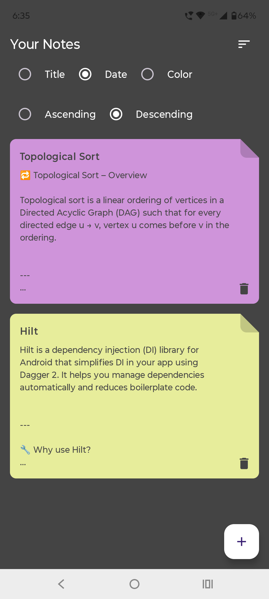
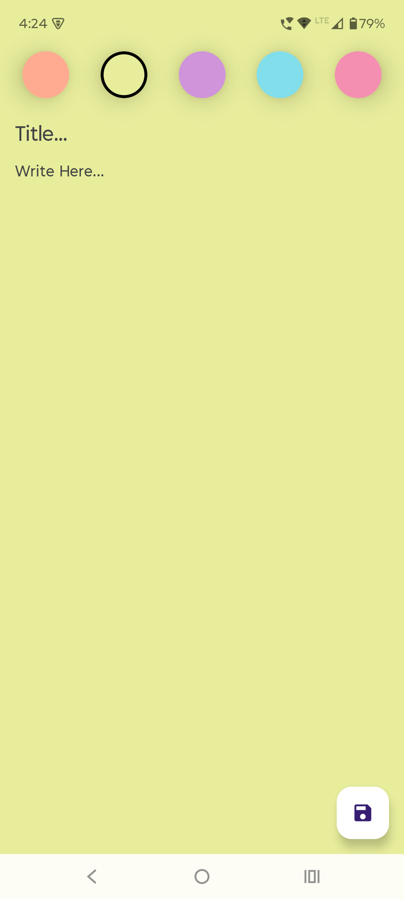

# Notes App

A modern Notes App built with Clean Architecture, MVVM, Hilt, Room, and Material 3 using Jetpack Compose.
Designed for speed, simplicity, and a beautiful writing experience.

---

## Features

-  Create, edit, and delete notes
-  Color-tag notes for better organization
-  Clean Architecture (Domain, Data, Presentation)
-  Dependency Injection with Hilt
-  Local storage using Room Database
-  MVVM architecture with ViewModel & StateFlow
-  Beautiful UI using Jetpack Compose + Material 3

---

## Tech Stack

| Layer        | Tools |
|--------------|-------|
| UI           | Jetpack Compose, Material 3 |
| Presentation | MVVM, ViewModel, StateFlow |
| Domain       | UseCases, Models, Repository Interface |
| Data         | Room, Repository Implementation |
| DI           | Hilt |
| Language     | Kotlin |

---

## Screenshots

> Example:
> ### Notes List Screen

<p align="center">
  
</p>

### Add Note Screen

<p align="center">
  
</p>


---

## Getting Started

1. **Clone the repo**
```bash
git clone https://github.com/S4marthX/Synapse.git